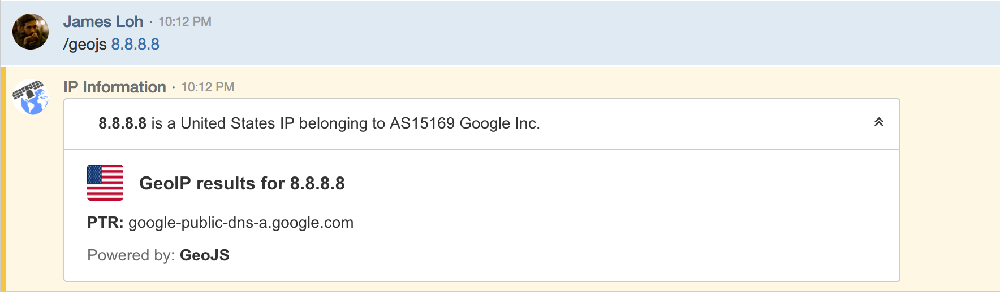

# ChatOps

<DO/>

## Overview

GeoJS currently integrates with Slack, Twist App and HipChat enabling you to lookup IP information directly from chat. 

## Slack

### Installation

Slack make installation super easy. Either [click here](https://slack.com/oauth/authorize?&client_id=159217363895.234425956290&scope=commands), use the button below or [search their Marketplace](https://slack.com/apps/search?q=GeoJS).

<slack-button/>

### Usage

We currently only have one command, our slash command, which you can use by typing `/geojs [ip in here]`. For example `/geojs 8.8.8.8`.

If you would like to show the result to the whole channel type `display` after the IP you’re trying to lookup, eg `/geojs 8.8.8.8 display`.

### Support

Should you run into any issues with the Slack app, you can reach out to my via the [contact page](/contact/) or via [Twitter](https://jloh.co/l/twitter).

This information is also displayed using `/geojs help` inside Slack.

## Twist App

### Installation

Twist makes it super easy to install the integration. You can find it in [their marketplace](https://twistapp.com/integrations/install/198_a1a4dc4678cb01d89cdc4533).

### Usage

Use the `/geojs` slash command in chat. For example /geojs 8.8.8.8.

## HipChat

::: warning DEPRECATION NOTE
HipChat has been [acquired by Slack](https://www.atlassian.com/blog/announcements/new-atlassian-slack-partnership) and as such our integration will not recieve further updates/be ported to v2 of our API.
:::

### Installation

The HipChat integration can be installed by using a Integration URL, which you can find here [https://get.geojs.io/v1/hooks/hipchat/install](https://get.geojs.io/v1/hooks/hipchat/install)

### Usage

After installation, you can use the integration by using the GeoJS slash command. For example `/geojs 8.8.8.8`.

